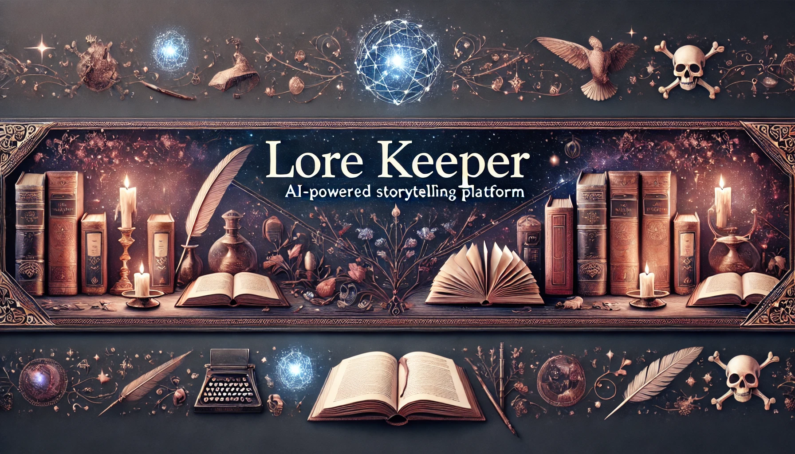

# 📚 Lore Keeper



An elegant AI-powered storytelling platform that creates personalized stories across multiple genres using Google's Gemini AI.

## ✨ Features

### 🎭 Genre & Theme Selection
- Multiple genres including Fantasy, Sci-Fi, Mystery, Romance, Horror, Historical Fiction, and Adventure
- Customizable themes within each genre
- Dynamic story generation based on selected preferences

### 📖 Reading Experience
- Clean, distraction-free reading interface
- Progress bar tracking
- Estimated reading time
- Infinite scroll for continuous story generation
- Text-to-Speech functionality
- Customizable font settings
  - Multiple font families
  - Adjustable font size
  - Dark/Light theme toggle

### 📱 Mobile-Friendly
- Responsive design
- Touch gestures support
- Swipe navigation for settings
- Mobile-optimized UI elements

### 🎨 Customization
- Theme switching (Light/Dark mode)
- Font family selection
- Text size adjustment
- Reading progress tracking

## 🚀 Getting Started

### Prerequisites
- Python 3.8+
- Flask
- Google Generative AI API key

### Installation

1. Clone the repository
```bash
git clone https://github.com/yourusername/lore-keeper.git
cd lore-keeper
```
2. Install dependencies
```bash
pip install -r requirements.txt
```
3. Set up Google Generative AI API key
- Obtain an API key from Google Cloud Console
- Set the `GOOGLE_API_KEY` environment variable
```bash
export GOOGLE_API_KEY='your_api_key_here'
``` 
4. Run the application
```bash
python api/app.py
``` 

## 🛠️ Technology Stack

- **Frontend**: HTML5, CSS3, JavaScript
- **Backend**: Flask (Python)
- **AI**: Google Gemini 1.5 Flash
- **Styling**: Custom CSS with CSS Variables
- **Fonts**: Google Fonts (Crimson Text)

## 🎯 Usage

1. Select your preferred genre and theme
2. Start reading the generated story
3. Scroll to automatically generate more content
4. Use the settings panel to customize your reading experience
5. Toggle Text-to-Speech for audio narration

## 🎨 Customization Options

### Themes
- Light Mode
- Dark Mode

### Fonts
- Crimson Text
- Georgia
- Palatino
- Baskerville

### Reading Features
- Adjustable font size
- Progress tracking
- Reading time estimation
- Text-to-Speech

## 📱 Mobile Features

- Swipe gestures for navigation
- Mobile-optimized layout
- Touch-friendly controls
- Responsive design

## 🤝 Contributing

Contributions are welcome! Please feel free to submit a Pull Request.

## 🙏 Acknowledgments

- Google Generative AI for the story generation
- Flask community for the excellent web framework

---

<p align="center">Made with ❤️ for storytelling enthusiasts</p>